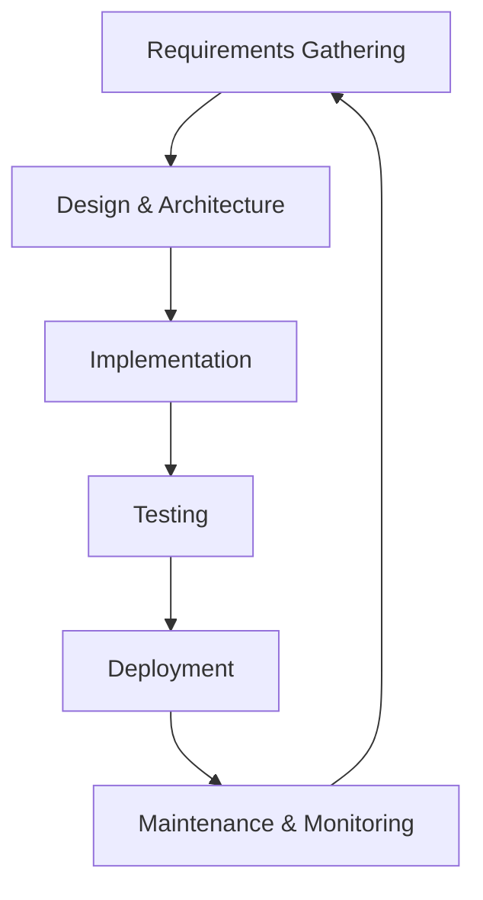

import Tabs from '@theme/Tabs';
import TabItem from '@theme/TabItem';

# AI Agent Powered Software Development Lifecycle

## Overview
The AI Agent Powered SDLC leverages intelligent agents to accelerate, automate, and enhance every phase of software development, from requirements to deployment and maintenance.

---

## Key Phases



---

## Example: Project Requirement Document
A well-written Project Requirement Document (PRD) is foundational for AI-powered workflows. Here’s an example structure:

<Tabs>
<TabItem value="images" label="Images" default>

### Chat Model Usage


### Cursor Project Rules


</TabItem>
<TabItem value="markdown" label="Markdown Example">

```markdown
# Project Requirement Document

## 1. Project Overview
Brief description of the project and its goals.

## 2. Tech Stack Preference
- Next.js
- Supabase
- (Other mainstream frameworks)

## 3. AI Model Usage Preference


*Figure: Example of AI model selection and usage in a modern development workflow (reference: Cursor IDE analytics).*

## 4. Functional Requirements
- List of features and requirements.

## 5. Acceptance Criteria
- What does "done" look like for each feature?

## 6. Implementation Plan
- Stepwise plan for AI agent execution.
```

</TabItem>
</Tabs>

---

## Embedding Diagrams and Images
- Use Mermaid for flowcharts and diagrams.
- Embed analytics or preference screenshots for clarity and transparency.

---

## References
- Cursor IDE analytics for model usage.
- Modern AI-driven SDLC best practices.
