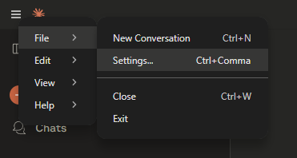
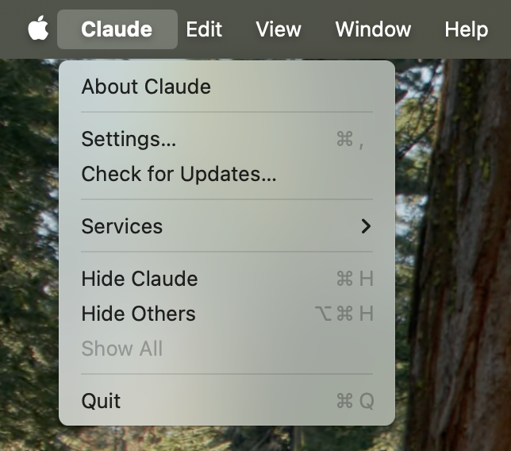

import Tabs from '@theme/Tabs';
import TabItem from '@theme/TabItem';

# MySQL
# MySQL MCP Installation Guide

## Overview

This guide walks you through installing all necessary components to run the MCP‑Server‑MySQL inside the Claude Desktop app on both Windows and macOS, and explains how to install the same MCP server in Cursor IDE. You will:

1. Install [**Node.js**](https://nodejs.org/en), the JavaScript runtime required by the MCP server.
2. Install [**Claude Desktop**](https://claude.ai/download), Anthropic’s desktop client for Claude AI.
3. Clone, build, and configure the **mcp-server-mysql** repository within **Claude Desktop**’s MCP server settings.
4. Configure and integrate the MCP server in **Cursor IDE** using the `.cursor/mcp.json` configuration.

By the end, you’ll have a local MCP server that connects both Claude Desktop and Cursor IDE to your MySQL database, enabling secure, high‑performance SQL operations across both environments.

---


## 1. Install Node.js

Node.js is a free, open‑source, cross‑platform JavaScript runtime used to run the MCP server.

1. Go to the official Node.js website: [Node.js](https://nodejs.org/en/)
2. Click **“Windows Installer (.msi)”** for Windows systems or **macOS Installer** (`.pkg`) for MacOS systems under the LTS (Long‑Term Support) section.
3. Run the downloaded `.msi`/`.pkg` file and follow the installer prompts (accept the license, choose install directory, etc.).  
4. After installation, open **Command Prompt** or your **Terminal** and verify by running:  
   ```bash
   node --version
   npm --version
   ```  
   You should see version numbers printed.

---

## 2. Install Claude Desktop

Claude Desktop is Anthropic’s native desktop client for interacting with Claude AI without a browser.

### Windows

1. Navigate to **https://claude.ai/download**.  
2. Click **“Windows”** to download the `.exe` installer.
3. Run the downloaded installer and follow the on‑screen steps.  
4. Launch **Claude** from the Start menu and sign in with your Anthropic account.

### macOS

1. Go to **https://claude.ai/download**.  
2. Click **“macOS”** to download the `.dmg` file.
3. Open the `.dmg` and drag **Claude** into your **Applications** folder.  
4. Launch Claude from Launchpad or Applications, then sign in.

---

## 3. Install and Configure the MCP Server in Claude Desktop

In this section, you will configure Claude Desktop to use it as an MCP server.

### 3.1 Configure Claude Desktop

1. Get started by opening up the Claude menu on your computer and select “Settings…” Please note that these are not the Claude Account Settings found in the app window itself.

    This is what it should look like:

    <Tabs>
      <TabItem value="windows" label="Windows" default>
        
      </TabItem>
      <TabItem value="macos" label="MacOS">
        
      </TabItem>
    </Tabs>

2. Click on “Developer” in the left-hand bar of the Settings pane, and then click on “Edit Config”:

    

    This will create a configuration file at:
       - **Windows**: `%APPDATA%\Claude\claude_desktop_config.json`  
       - **macOS**: `~/Library/Application`

3. Open `claude_desktop_config.json` in a text editor and Replace the file contents with this:
  <Tabs>
    <TabItem value="windows" label="Windows" default>
      ```json
      {
        "mcpServers": {
          "mcp_server_mysql": {
            "command": "npx",
            "args": [
              "-y",
              "@benborla29/mcp-server-mysql"
            ],
            "env": {
              "MYSQL_HOST": "your_host",
              "MYSQL_PORT": "your_port",
              "MYSQL_USER": "your_username",
              "MYSQL_PASS": "your_password",
              "MYSQL_DB": "your_database",
              "ALLOW_INSERT_OPERATION": "false",
              "ALLOW_UPDATE_OPERATION": "false",
              "ALLOW_DELETE_OPERATION": "false",
                "PATH": "absolute\\path\\to\\nodejs\\",
                "NODE_PATH": "absolute\\path\\to\\nodejs\\node_modules\\",
                "APPDATA": "absolute\\path\\to\\AppData\\Roaming\\"
            }
          }
        }
      }
      ```
    </TabItem>
    <TabItem value="macos" label="MacOS">
      ```json
      {
        "mcpServers": {
          "mcp_server_mysql": {
            "command": "npx",
            "args": [
              "-y",
              "@benborla29/mcp-server-mysql"
            ],
            "env": {
              "MYSQL_HOST": "your_host",
              "MYSQL_PORT": "your_port",
              "MYSQL_USER": "your_username",
              "MYSQL_PASS": "your_password",
              "MYSQL_DB": "your_database",
              "ALLOW_INSERT_OPERATION": "false",
              "ALLOW_UPDATE_OPERATION": "false",
              "ALLOW_DELETE_OPERATION": "false",
              "PATH": "absolute/path/to/node/bin:/usr/bin:/bin",
              "NODE_PATH": "absolute/path/to/node/lib/node_modules"
            }
          }
        }
      }
      ```
    </TabItem>
  </Tabs>

    Don't forget to replace these values in the config : 
    - `/absolute/path/to/node` (MacOS) -> full path to your `node` binary (use `which node` in your terminal)
    - `absolute\\path\\to\\node` (Windows) -> full path to your `node` binary (use `where node` in your terminal)
    - `absolute\\path\\to\\AppData\\Roaming\\` (Windows) -> full path to your `Appdata/Roaming` (Search for "Run" in the windows search. or press the Windows + R button to open the Run App. In the run app text box, enter "%AppData%" and click OK.)
    
    *NOTE: To get the MySQL credentials for KMPlus' clients database, please contact you nearest KMPlus engineer or anyone who has the credentials.

4. Save and close the file.

### Troubleshooting

- **“Command not found” errors**: Ensure the `command` path in `claude_desktop_config.json` points to your Node.js binary.
- **MySQL connection refused**: Verify your MySQL server is running and that `MYSQL_HOST`, `MYSQL_PORT`, and credentials are correct.  
- **Permission issues**: If you need write access, set `ALLOW_INSERT_OPERATION`, `ALLOW_UPDATE_OPERATION`, and `ALLOW_DELETE_OPERATION` to `"true"`, and ensure your MySQL user has those privileges.
- **Logs**:  
  - **Windows**: `%LOCALAPPDATA%\Claude\Logs\mcp-server-mysql.log`  
  - **macOS**: `~/Library/Logs/Claude/mcp-server-mysql.log`

---

## 4. Install the MCP Server in Cursor IDE

Cursor IDE uses a Model Context Protocol (MCP) configuration file named `mcp.json`, which can be scoped either to a specific project (`.cursor/mcp.json`) or applied globally (`~/.cursor/mcp.json`) for all workspaces. ([docs.cursor.com](https://docs.cursor.com/context/model-context-protocol?utm_source=chatgpt.com))

### 4.1 Create or Locate the MCP Configuration File

1. **Project-Specific Configuration**: Open your project folder and ensure a hidden folder named `.cursor` exists at the root. If it does not exist, create it.
2. **Global Configuration (Optional)**: To make the MCP server available across all projects, locate or create the file `~/.cursor/mcp.json` on macOS/Linux or `%USERPROFILE%\.cursor\mcp.json` on Windows.
3. Open (or create) `mcp.json` in the chosen location using your text editor or via **Cursor Settings → MCP**, which loads the same file for you to edit in the UI.

### 4.2 Add the MCP Server Entry

Paste the following JSON snippet into your `mcp.json` file, replacing placeholder paths and credentials with your actual values:  
```json
{
  "mcpServers": {
    "mcp_server_mysql": {
      "command": "npx",
      "args": [
        "mcprunner",
        "MYSQL_HOST": "your_host",
        "MYSQL_PORT": "your_port",
        "MYSQL_USER": "your_username",
        "MYSQL_PASS": "your_password",
        "MYSQL_DB": "your_database",
        "ALLOW_INSERT_OPERATION": "false",
        "ALLOW_UPDATE_OPERATION": "false",
        "ALLOW_DELETE_OPERATION": "false",
        "--",
        "npx",
        "-y",
        "@benborla29/mcp-server-mysql"
      ]
    }
  }
}
```  

### 4.3 Apply and Verify

1. Save `mcp.json` and restart Cursor IDE to apply the new MCP server configuration.
2. Open a chat inside Cursor and invoke the SQL tool by telling the agent to use `mcp_server_mysql`, for example:  
   > "Show me all tables in the MySQL database via `mcp_server_mysql`."  
3. Verify that the tool runs successfully and returns your MySQL tables, confirming the MCP server is active.

---

With Node.js, Claude Desktop, and Cursor IDE now configured to use your MCP‑Server‑MySQL, you can leverage AI-powered SQL queries seamlessly across both environments, boosting productivity and enabling advanced data-driven workflows.